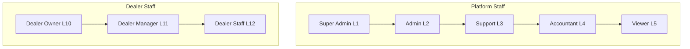
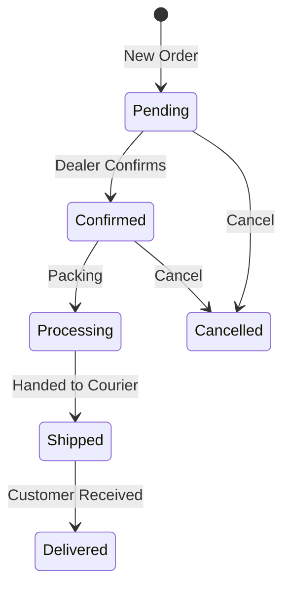

# 🛡️ RoyalConsortium Admin Panel - Complete Implementation

> **Luxury Automotive Dark Mode** — Senior Frontend Architect Design
> **Design Philosophy**: Intentional Minimalism + Data-Rich Dashboards

---

## 🎨 Design Direction

| Aspect | Choice |
|--------|--------|
| **Theme** | Luxury Automotive Dark Mode |
| **Typography** | Playfair Display (headers) + DM Sans (body) |
| **Primary** | Deep Charcoal `#0D0D0F` |
| **Accent** | Champagne Gold `#D4AF37` |
| **Secondary** | Pearl White `#F8F8F8` |
| **CTA** | Racing Red `#DC2626` |
| **Charts** | Recharts with custom dark theme |

---

## 📊 Role Hierarchy & Portal Access



---

# 🔐 SUPER ADMIN PORTAL (`/super-admin/*`)

## Dashboard (`/super-admin/dashboard`)

### Layout: 4-Column Grid with Full-Width Charts

```
┌─────────────────────────────────────────────────────────────────┐
│  HEADER: Welcome back, Admin Name | Last login: 2 hours ago    │
├─────────────────────────────────────────────────────────────────┤
│                                                                 │
│  ┌─────────┐  ┌─────────┐  ┌─────────┐  ┌─────────┐            │
│  │ REVENUE │  │ ORDERS  │  │ DEALERS │  │ PRODUCTS│            │
│  │ ৳2.5M   │  │  1,247  │  │   156   │  │  4,892  │            │
│  │ +12.5%  │  │ +8.3%   │  │ +15     │  │ +234    │            │
│  └─────────┘  └─────────┘  └─────────┘  └─────────┘            │
│                                                                 │
│  ┌─────────────────────────────────────────────────────────────┐│
│  │           REVENUE CHART (Area Chart - 30 days)             ││
│  │  ▲                                                         ││
│  │  │     ╭───╮                      ╭────╮                   ││
│  │  │   ╭─╯   ╰───╮               ╭──╯    ╰──╮                ││
│  │  │ ──╯         ╰───────────────╯          ╰──              ││
│  │  └─────────────────────────────────────────────────────▶   ││
│  └─────────────────────────────────────────────────────────────┘│
│                                                                 │
│  ┌──────────────────────────┐  ┌──────────────────────────────┐│
│  │   SUBSCRIPTION INCOME    │  │   COMMISSION INCOME          ││
│  │   (Donut Chart)          │  │   (Bar Chart by Dealer)      ││
│  │                          │  │                              ││
│  │   ◕ Starter: 45%         │  │   ▓▓▓▓▓▓▓▓ Dealer A         ││
│  │   ◕ Pro: 35%             │  │   ▓▓▓▓▓▓ Dealer B           ││
│  │   ◕ Enterprise: 20%      │  │   ▓▓▓▓ Dealer C             ││
│  └──────────────────────────┘  └──────────────────────────────┘│
│                                                                 │
│  ┌──────────────────────────┐  ┌──────────────────────────────┐│
│  │   PENDING APPROVALS      │  │   CRITICAL ALERTS            ││
│  │   ────────────────────   │  │   ────────────────────       ││
│  │   🏪 12 Dealers          │  │   ⚠️ Payment gateway slow     ││
│  │   📦 34 Products         │  │   🔴 3 Failed payouts        ││
│  │   💰 5 Refunds           │  │   ⚡ Server load: 78%        ││
│  └──────────────────────────┘  └──────────────────────────────┘│
│                                                                 │
│  ┌─────────────────────────────────────────────────────────────┐│
│  │   RECENT TRANSACTIONS TABLE                                ││
│  │   ─────────────────────────────────────────────────────    ││
│  │   ID       | Dealer      | Amount   | Type    | Status     ││
│  │   TXN-001  | BikeWorld   | ৳12,500  | Order   | Paid       ││
│  │   TXN-002  | MotoMart    | ৳8,200   | Order   | Pending    ││
│  │   TXN-003  | SpeedZone   | ৳2,499   | Subscription| Paid   ││
│  └─────────────────────────────────────────────────────────────┘│
└─────────────────────────────────────────────────────────────────┘
```

### Dashboard Widgets (Database Sources)

| Widget | Data Source | SQL Query Example |
|--------|-------------|-------------------|
| **Total Revenue** | `orders.grand_total` | `SUM(grand_total) WHERE payment_status='paid'` |
| **Revenue Trend** | `orders` by date | `GROUP BY DATE(created_at)` |
| **Subscription Income** | `subscription_invoices` | `SUM(amount) WHERE status='paid'` |
| **Commission Income** | `commissions` | `SUM(commission_amount)` |
| **Active Dealers** | `dealers` | `COUNT(*) WHERE status='active'` |
| **Pending Approvals** | `dealers`, `products` | `WHERE status='pending'` |
| **Orders Today** | `orders` | `WHERE DATE(created_at) = TODAY` |
| **Top Dealers** | `dealers.total_revenue` | `ORDER BY total_revenue DESC LIMIT 10` |
| **Category Sales** | `order_items` + `products` | `GROUP BY category_id` |
| **Payment Methods** | `payments.method` | `GROUP BY method` |

---

### KPI Cards (4 Primary Metrics)

```typescript
interface KPICard {
  title: string;
  value: string | number;
  change: number;        // +12.5% or -5.2%
  changeLabel: string;   // "vs last month"
  icon: LucideIcon;
  trend: 'up' | 'down' | 'neutral';
  sparklineData?: number[]; // Mini chart
}

const dashboardKPIs: KPICard[] = [
  {
    title: "Total Revenue",
    value: "৳2,547,890",
    change: 12.5,
    changeLabel: "vs last month",
    icon: Wallet,
    trend: "up",
    sparklineData: [12, 19, 15, 25, 22, 30, 28]
  },
  {
    title: "Total Orders",
    value: 1247,
    change: 8.3,
    changeLabel: "vs last month", 
    icon: ShoppingCart,
    trend: "up"
  },
  {
    title: "Active Dealers",
    value: 156,
    change: 15,
    changeLabel: "new this month",
    icon: Store,
    trend: "up"
  },
  {
    title: "Products Live",
    value: 4892,
    change: 234,
    changeLabel: "approved this week",
    icon: Package,
    trend: "up"
  }
];
```

---

### Revenue Analytics Charts

#### 1. Revenue Trend (Area Chart)

```typescript
// Data from: orders table
interface RevenueTrendData {
  date: string;
  revenue: number;
  orders: number;
}

// Query: 
// SELECT DATE(created_at) as date, 
//        SUM(grand_total) as revenue,
//        COUNT(*) as orders
// FROM orders WHERE payment_status = 'paid'
// GROUP BY DATE(created_at)
// ORDER BY date DESC LIMIT 30
```

#### 2. Income Breakdown (Donut Chart)

```typescript
// Sources:
// - subscription_invoices.amount (Subscription Income)
// - commissions.commission_amount (Commission Income)
// - Platform fees from orders

interface IncomeBreakdown {
  source: 'subscription' | 'commission' | 'fees';
  amount: number;
  percentage: number;
}
```

#### 3. Top Dealers by Revenue (Horizontal Bar)

```typescript
// Data from: dealers.total_revenue (denormalized)
// Or calculated: SUM(sub_orders.dealer_amount) GROUP BY dealer_id

interface TopDealer {
  dealer_id: string;
  business_name: string;
  revenue: number;
  orders: number;
  commission_paid: number;
}
```

#### 4. Category Performance (Pie/Treemap)

```typescript
// Query:
// SELECT c.name, SUM(oi.total_price) as sales
// FROM order_items oi
// JOIN products p ON p.id = oi.product_id
// JOIN categories c ON c.id = p.category_id
// GROUP BY c.id
// ORDER BY sales DESC
```

---

### Data Tables

#### Recent Orders Table

| Column | Source |
|--------|--------|
| Order Number | `orders.order_number` |
| Customer | `users.full_name` via `orders.user_id` |
| Dealer(s) | `dealers.business_name` via `order_items` |
| Amount | `orders.grand_total` |
| Status | `orders.status` |
| Payment | `orders.payment_status` |
| Date | `orders.created_at` |

#### Pending Approvals Table

| Item Type | Source | Action |
|-----------|--------|--------|
| Dealer | `dealers WHERE status='pending'` | Approve/Reject |
| Product | `products WHERE status='pending'` | Approve/Reject |
| Refund | `refunds WHERE status='pending'` | Approve/Deny |

---

## Financial Reports (`/super-admin/reports`)

### Report Types

#### 1. Platform Revenue Report

```typescript
interface PlatformRevenueReport {
  period: 'daily' | 'weekly' | 'monthly' | 'yearly';
  
  summary: {
    grossRevenue: number;      // SUM(orders.grand_total)
    netRevenue: number;        // After refunds
    subscriptionIncome: number;
    commissionIncome: number;
    refundsProcessed: number;
    platformProfit: number;    // subscription + commission
  };
  
  charts: {
    revenueByDay: TimeSeriesData[];
    revenueByCategory: CategoryData[];
    revenueByDealer: DealerData[];
    paymentMethods: PieData[];
  };
}
```

#### 2. Dealer Performance Report

```typescript
interface DealerReport {
  dealer_id: string;
  
  metrics: {
    totalRevenue: number;        // dealers.total_revenue
    totalOrders: number;         // dealers.total_orders
    averageOrderValue: number;   // revenue / orders
    averageRating: number;       // dealers.average_rating
    productCount: number;        // dealers.total_products
    conversionRate: number;      // orders / product_views
  };
  
  charts: {
    revenueTimeline: TimeSeriesData[];
    topProducts: ProductData[];
    ordersByStatus: PieData[];
  };
}
```

#### 3. Commission Report

```typescript
// From: commissions table
interface CommissionReport {
  period: DateRange;
  
  summary: {
    totalCommission: number;
    averageRate: number;
    byPlan: {
      starter: number;
      professional: number;
      enterprise: number;
    };
  };
  
  dealerBreakdown: {
    dealer_id: string;
    business_name: string;
    orderValue: number;
    commissionRate: number;
    commissionAmount: number;
    pendingPayout: number;
  }[];
}
```

#### 4. Subscription Report

```typescript
// From: subscriptions, plans, subscription_invoices
interface SubscriptionReport {
  summary: {
    totalActiveSubscriptions: number;
    monthlyRecurringRevenue: number;  // MRR
    churnRate: number;
    byPlan: {
      plan_name: string;
      count: number;
      revenue: number;
    }[];
  };
  
  charts: {
    subscriptionGrowth: TimeSeriesData[];
    planDistribution: PieData[];
    renewalRate: number;
  };
}
```

---

## Dealer Management (`/super-admin/dealers`)

### Dealer List View

| Column | Source | Sortable | Filterable |
|--------|--------|:--------:|:----------:|
| Business Name | `dealers.business_name` | ✅ | ✅ |
| Owner | `users.full_name` | ✅ | ✅ |
| Status | `dealers.status` | ✅ | ✅ |
| Plan | `plans.name` | ✅ | ✅ |
| Products | `dealers.total_products` | ✅ | - |
| Revenue | `dealers.total_revenue` | ✅ | - |
| Rating | `dealers.average_rating` | ✅ | - |
| Joined | `dealers.created_at` | ✅ | ✅ |

### Dealer Detail View

```
┌─────────────────────────────────────────────────────────────────┐
│  DEALER PROFILE HEADER                                          │
│  ┌──────┐  BikeWorld Bangladesh                                │
│  │ LOGO │  ⭐ 4.8 (234 reviews) | 📍 Dhaka | 🏪 Active         │
│  └──────┘  Plan: Professional | Member since: Jan 2024         │
├─────────────────────────────────────────────────────────────────┤
│                                                                 │
│  TABS: [Overview] [Products] [Orders] [Finance] [Documents]    │
│                                                                 │
│  ┌─────────┐  ┌─────────┐  ┌─────────┐  ┌─────────┐            │
│  │ REVENUE │  │ ORDERS  │  │PRODUCTS │  │COMMISSION│            │
│  │ ৳850K   │  │   423   │  │   187   │  │  ৳68K   │            │
│  └─────────┘  └─────────┘  └─────────┘  └─────────┘            │
│                                                                 │
│  ┌──────────────────────────────┐  ┌─────────────────────────┐ │
│  │  REVENUE CHART (6 months)    │  │  PRODUCTS BY CATEGORY   │ │
│  │                              │  │                         │ │
│  └──────────────────────────────┘  └─────────────────────────┘ │
│                                                                 │
│  ACTIONS:                                                       │
│  [Override Limits] [Change Plan] [Suspend Dealer] [Delete]     │
└─────────────────────────────────────────────────────────────────┘
```

---

## Payment & Payouts (`/super-admin/payments`)

### Payment Dashboard

```typescript
interface PaymentDashboard {
  summary: {
    totalTransactions: number;
    successfulPayments: number;
    failedPayments: number;
    pendingPayouts: number;
    refundsThisMonth: number;
  };
  
  byMethod: {
    bkash: { count: number; amount: number };
    nagad: { count: number; amount: number };
    cod: { count: number; amount: number };
  };
  
  recentTransactions: Payment[];
  failedTransactions: Payment[];
  pendingRefunds: Refund[];
}
```

### Payout Management

```
┌─────────────────────────────────────────────────────────────────┐
│  PENDING PAYOUTS                                                │
│  ─────────────────────────────────────────────────────────────  │
│                                                                 │
│  ┌─────────────────────────────────────────────────────────┐   │
│  │ BikeWorld Bangladesh                                     │   │
│  │ Amount: ৳45,230 | Orders: 23 | Commission: ৳5,430       │   │
│  │ Bank: DBBL - ****4521 | Status: Ready                   │   │
│  │ [Process Payout] [View Details]                         │   │
│  └─────────────────────────────────────────────────────────┘   │
│                                                                 │
│  ┌─────────────────────────────────────────────────────────┐   │
│  │ MotoMart Chittagong                                      │   │
│  │ Amount: ৳28,750 | Orders: 15 | Commission: ৳3,450       │   │
│  │ bKash: 01712****89 | Status: Ready                      │   │
│  │ [Process Payout] [View Details]                         │   │
│  └─────────────────────────────────────────────────────────┘   │
└─────────────────────────────────────────────────────────────────┘
```

---

## Audit Logs (`/super-admin/audit-logs`)

### Log Entry Structure

```typescript
// From: audit_logs table
interface AuditLogEntry {
  id: string;
  user_email: string;
  user_role: string;
  action: string;            // e.g., "dealer.approve"
  action_type: 'create' | 'update' | 'delete' | 'approve' | 'reject';
  module: string;            // e.g., "dealers"
  resource_type: string;
  resource_name: string;
  old_values: object | null;
  new_values: object | null;
  ip_address: string;
  created_at: string;
  severity: 'info' | 'warning' | 'error' | 'critical';
}
```

### Log Viewer Features

- **Search**: By user, action, resource
- **Filter**: By date range, severity, module
- **Export**: CSV, PDF download
- **Timeline View**: Chronological visualization

---

## Emergency Controls (`/super-admin/emergency`)

```
┌─────────────────────────────────────────────────────────────────┐
│  ⚠️ EMERGENCY CONTROLS - USE WITH CAUTION                      │
├─────────────────────────────────────────────────────────────────┤
│                                                                 │
│  ┌─────────────────────────────────────────────────────────┐   │
│  │ 🔴 FREEZE DEALER                                         │   │
│  │ Immediately suspend all operations for a specific dealer │   │
│  │ [Select Dealer ▼] [Freeze Now]                          │   │
│  └─────────────────────────────────────────────────────────┘   │
│                                                                 │
│  ┌─────────────────────────────────────────────────────────┐   │
│  │ 💰 FREEZE ALL PAYMENTS                                   │   │
│  │ Stop all payment processing platform-wide               │   │
│  │ [Freeze Payments] - Currently: ✅ Active                │   │
│  └─────────────────────────────────────────────────────────┘   │
│                                                                 │
│  ┌─────────────────────────────────────────────────────────┐   │
│  │ 🔧 MAINTENANCE MODE                                       │   │
│  │ Show maintenance page to all users except super admins  │   │
│  │ [Enable Maintenance] - Currently: ❌ Disabled           │   │
│  └─────────────────────────────────────────────────────────┘   │
│                                                                 │
│  ┌─────────────────────────────────────────────────────────┐   │
│  │ 🚪 FORCE LOGOUT ALL                                      │   │
│  │ Invalidate all user sessions immediately                │   │
│  │ [Force Logout All Users]                                │   │
│  └─────────────────────────────────────────────────────────┘   │
│                                                                 │
└─────────────────────────────────────────────────────────────────┘
```

---

# 👔 ADMIN PORTAL (`/admin/*`)

## Dashboard (`/admin/dashboard`)

### Simplified KPIs (4 Cards)

| Metric | Source |
|--------|--------|
| Pending Dealers | `dealers WHERE status='pending'` |
| Pending Products | `products WHERE status='pending'` |
| Today's Orders | `orders WHERE DATE(created_at) = TODAY` |
| Open Tickets | `support_tickets WHERE status='open'` |

### Quick Actions

- Approve Dealers Queue
- Product Moderation Queue
- Refund Requests

---

## Product Moderation (`/admin/products`)

### Moderation Queue

```
TABS: [Pending (34)] [Approved] [Rejected] [Blocked]

┌─────────────────────────────────────────────────────────────────┐
│  PRODUCT CARD                                                   │
│  ┌──────┐  Gixxer SF 155 Brake Pad Set                         │
│  │ IMG  │  Category: Spare Parts > Brake Pads                  │
│  └──────┘  Dealer: BikeWorld | Price: ৳1,250                   │
│            Submitted: 2 hours ago                               │
│                                                                 │
│  [View Details] [Quick Approve ✓] [Reject ✗]                   │
└─────────────────────────────────────────────────────────────────┘
```

### Product Review Page

- Full product preview (as customer sees)
- Dealer information sidebar
- Approval actions with optional feedback
- Image verification
- Price validation

---

# 🏪 DEALER PORTAL (`/dealer/*`)

## Role-Based Access Matrix

| Feature | Owner | Manager | Staff |
|---------|:-----:|:-------:|:-----:|
| Dashboard | ✅ | ✅ | ✅ |
| Revenue/Profit Charts | ✅ | ✅ | ❌ |
| Products CRUD | ✅ | ✅ | ⚙️ |
| Orders Management | ✅ | ✅ | ⚙️ |
| Team Management | ✅ | ❌ | ❌ |
| Subscription | ✅ | ❌ | ❌ |
| Analytics | ✅ | ✅ | ❌ |
| Settings | ✅ | ⚙️ | ❌ |
| Finance/Payouts | ✅ | ⚙️ | ❌ |

---

## Dealer Dashboard (`/dealer/dashboard`)

### Layout

```
┌─────────────────────────────────────────────────────────────────┐
│  SUBSCRIPTION BAR                                               │
│  Professional Plan | 23 days remaining | ▓▓▓▓▓▓░░ 45/200 prods │
├─────────────────────────────────────────────────────────────────┤
│                                                                 │
│  ┌─────────┐  ┌─────────┐  ┌─────────┐  ┌─────────┐            │
│  │ REVENUE │  │ ORDERS  │  │ PROFIT  │  │ PENDING │            │
│  │ ৳125K   │  │   89    │  │ ৳112K   │  │   7     │            │
│  │ +18.5%  │  │ +12 new │  │ margin  │  │ orders  │            │
│  └─────────┘  └─────────┘  └─────────┘  └─────────┘            │
│                                                                 │
│  ┌───────────────────────────────────────────────────────────┐ │
│  │  SALES CHART (Line/Area - 30 days)                        │ │
│  │  ── Revenue ── Orders ── Profit                           │ │
│  │                                                           │ │
│  └───────────────────────────────────────────────────────────┘ │
│                                                                 │
│  ┌──────────────────────────┐  ┌────────────────────────────┐  │
│  │  TOP SELLING PRODUCTS    │  │  RECENT ORDERS             │  │
│  │  ─────────────────────   │  │  ─────────────────────     │  │
│  │  1. Brake Pad (45 sold)  │  │  #RC-2026-0045 - ৳3,200   │  │
│  │  2. Engine Oil (38 sold) │  │  #RC-2026-0044 - ৳1,850   │  │
│  │  3. Helmet (27 sold)     │  │  #RC-2026-0043 - ৳5,400   │  │
│  └──────────────────────────┘  └────────────────────────────┘  │
│                                                                 │
│  ┌──────────────────────────┐  ┌────────────────────────────┐  │
│  │  ⚠️ LOW STOCK ALERTS     │  │  💬 RECENT REVIEWS         │  │
│  │  ─────────────────────   │  │  ─────────────────────     │  │
│  │  • Chain Set (2 left)    │  │  ⭐⭐⭐⭐⭐ "Great quality"  │  │
│  │  • Brake Fluid (5 left)  │  │  ⭐⭐⭐⭐ "Fast delivery"   │  │
│  └──────────────────────────┘  └────────────────────────────┘  │
└─────────────────────────────────────────────────────────────────┘
```

### Dealer KPIs (Data Sources)

| KPI | Calculation | Source Tables |
|-----|-------------|---------------|
| **Total Revenue** | `SUM(sub_orders.subtotal)` | `sub_orders` |
| **Net Revenue** | Revenue - Commissions - Refunds | `sub_orders`, `commissions`, `refunds` |
| **Profit** | Net Revenue - Cost | `products.cost_price` × quantity |
| **Profit Margin** | (Profit / Revenue) × 100 | Calculated |
| **Orders This Month** | `COUNT(*)` this month | `sub_orders` |
| **Average Order Value** | Revenue / Orders | Calculated |
| **Pending Orders** | `WHERE status='pending'` | `sub_orders` |
| **Products Sold** | `SUM(order_items.quantity)` | `order_items` |

---

### Dealer Analytics Charts

#### 1. Revenue & Profit Timeline

```typescript
// Data for multi-line chart
interface DealerTimelineData {
  date: string;
  revenue: number;    // sub_orders.subtotal
  cost: number;       // products.cost_price * quantity
  profit: number;     // revenue - cost - commission
  orders: number;     // count
}
```

#### 2. Category Performance (Dealer's Products)

```typescript
// Which categories sell best for this dealer
// FROM order_items WHERE dealer_id = X
// JOIN products JOIN categories
// GROUP BY category
```

#### 3. Product Performance Table

| Product | Sold | Revenue | Profit | Stock | Status |
|---------|------|---------|--------|-------|--------|
| Brake Pad Set | 45 | ৳56,250 | ৳22,500 | 12 | 🟢 |
| Engine Oil 1L | 38 | ৳22,800 | ৳9,500 | 3 | 🔴 Low |

---

## Dealer Orders (`/dealer/orders`)

### Order Status Flow



### Order Actions by Status

| Status | Available Actions |
|--------|-------------------|
| Pending | Confirm, Cancel, Add Notes |
| Confirmed | Start Processing, Cancel |
| Processing | Mark Shipped, Add Tracking |
| Shipped | Mark Delivered |
| Delivered | View Only |

---

## Dealer Finance (`/dealer/finance`)

### Finance Dashboard

```
┌─────────────────────────────────────────────────────────────────┐
│  FINANCIAL SUMMARY                                              │
├─────────────────────────────────────────────────────────────────┤
│                                                                 │
│  ┌─────────────┐  ┌─────────────┐  ┌─────────────┐              │
│  │ TOTAL SALES │  │ COMMISSION  │  │  AVAILABLE  │              │
│  │  ৳850,000   │  │  ৳68,000    │  │  ৳782,000   │              │
│  │  this month │  │  (8% rate)  │  │  for payout │              │
│  └─────────────┘  └─────────────┘  └─────────────┘              │
│                                                                 │
│  ┌─────────────────────────────────────────────────────────┐   │
│  │  PAYOUT HISTORY                                          │   │
│  │  ─────────────────────────────────────────────────────   │   │
│  │  Date       | Amount    | Status  | Method    | Ref     │   │
│  │  Jan 15     | ৳125,000  | Paid    | bKash     | PO-001  │   │
│  │  Jan 01     | ৳98,500   | Paid    | Bank      | PO-002  │   │
│  │  Dec 15     | ৳112,000  | Paid    | bKash     | PO-003  │   │
│  └─────────────────────────────────────────────────────────┘   │
│                                                                 │
│  ┌─────────────────────────────────────────────────────────┐   │
│  │  COMMISSION BREAKDOWN                                    │   │
│  │  ─────────────────────────────────────────────────────   │   │
│  │  Your Plan: Professional | Commission Rate: 8%          │   │
│  │  This Month: ৳68,000 commission on ৳850,000 sales       │   │
│  │  Upgrade to Enterprise for 5% rate → Save ৳25,500/mo    │   │
│  └─────────────────────────────────────────────────────────┘   │
└─────────────────────────────────────────────────────────────────┘
```

---

## Team Management (`/dealer/sub-users`) - Owner Only

### Team List

```
┌─────────────────────────────────────────────────────────────────┐
│  TEAM MEMBERS (3/5 slots used)                    [+ Add Member]│
├─────────────────────────────────────────────────────────────────┤
│                                                                 │
│  ┌─────────────────────────────────────────────────────────┐   │
│  │  👤 Mohammad Rahim (You)                    OWNER        │   │
│  │     rahim@bikeworld.com | All Permissions                │   │
│  └─────────────────────────────────────────────────────────┘   │
│                                                                 │
│  ┌─────────────────────────────────────────────────────────┐   │
│  │  👤 Karim Uddin                             MANAGER      │   │
│  │     karim@bikeworld.com | Products, Orders, Reports     │   │
│  │     [Edit Permissions] [Deactivate]                     │   │
│  └─────────────────────────────────────────────────────────┘   │
│                                                                 │
│  ┌─────────────────────────────────────────────────────────┐   │
│  │  👤 Jamal Hossain                           STAFF        │   │
│  │     jamal@bikeworld.com | Orders Only                   │   │
│  │     [Edit Permissions] [Deactivate]                     │   │
│  └─────────────────────────────────────────────────────────┘   │
└─────────────────────────────────────────────────────────────────┘
```

### Permission Editor (from dealer_users table)

```typescript
interface StaffPermissions {
  can_manage_products: boolean;
  can_manage_orders: boolean;
  can_view_reports: boolean;
  can_manage_inventory: boolean;
  can_manage_coupons: boolean;
  can_manage_staff: boolean;  // Manager only
  can_view_finance: boolean;
  can_reply_reviews: boolean;
}
```

---

# 📁 Folder Structure

```
src/app/
├── super-admin/
│   ├── layout.tsx
│   ├── dashboard/
│   │   └── page.tsx            # Main dashboard
│   ├── dealers/
│   │   ├── page.tsx            # Dealer list
│   │   └── [id]/page.tsx       # Dealer detail
│   ├── users/page.tsx          # User management
│   ├── roles/page.tsx          # Permission matrix
│   ├── plans/page.tsx          # Subscription plans
│   ├── payments/page.tsx       # Payment management
│   ├── reports/
│   │   ├── page.tsx            # Report index
│   │   ├── revenue/page.tsx
│   │   ├── dealers/page.tsx
│   │   └── subscriptions/page.tsx
│   ├── audit-logs/page.tsx
│   ├── settings/page.tsx
│   └── emergency/page.tsx
│
├── admin/
│   ├── layout.tsx
│   ├── dashboard/page.tsx
│   ├── dealers/
│   │   ├── page.tsx
│   │   └── [id]/page.tsx
│   ├── products/
│   │   ├── page.tsx            # Moderation queue
│   │   └── [id]/page.tsx       # Product review
│   ├── orders/page.tsx
│   └── catalog/
│       ├── categories/page.tsx
│       ├── brands/page.tsx
│       └── bike-models/page.tsx
│
└── dealer/
    ├── layout.tsx
    ├── dashboard/page.tsx
    ├── products/
    │   ├── page.tsx
    │   ├── new/page.tsx
    │   └── [id]/edit/page.tsx
    ├── orders/
    │   ├── page.tsx
    │   └── [id]/page.tsx
    ├── analytics/page.tsx
    ├── finance/page.tsx
    ├── sub-users/page.tsx
    ├── subscription/page.tsx
    └── settings/page.tsx
```

---

# ✅ Implementation Checklist

### Phase 1: Layouts & Navigation
- [ ] Super Admin layout with dark theme
- [ ] Admin layout
- [ ] Dealer layout with subscription bar
- [ ] Role-based sidebar navigation

### Phase 2: Dashboard Components
- [ ] KPI cards with sparklines
- [ ] Revenue area chart (Recharts)
- [ ] Donut charts for breakdowns
- [ ] Data tables with sorting/filtering

### Phase 3: Dealer Portal
- [ ] Dashboard with sales data
- [ ] Product CRUD
- [ ] Order management
- [ ] Team management (owner)
- [ ] Finance view

### Phase 4: Admin Portal
- [ ] Dealer approval flow
- [ ] Product moderation
- [ ] Catalog management

### Phase 5: Super Admin
- [ ] Full dashboard with all metrics
- [ ] Reports module
- [ ] Audit logs viewer
- [ ] Emergency controls

---

## 🚀 Advanced & Smooth Features (Phase 6)

### 1. Global Command Palette (CMD+K)
- **Universal Search**: Instantly find any dealer, product, order, or setting.
- **Quick Actions**: "Assign dealer to plan", "Refund order #RC-123", "Toggle Maintenance".
- **Shortcuts**: Muscle-memory shortcuts for heavy users.

### 2. Supabase Realtime Sync
- **Live KPIs**: KPI cards (Revenue, Orders) update instantly when database records change.
- **Activity Feed**: Real-time notification toast for new dealer registrations or critical order updates.
- **Presence Indication**: See "Currently Editing" badges on product pages to prevent overwrites.

### 3. Progressive UX & Motion
- **Contextual Side-Drawers**: Use side-panels (sheets) for minor edits instead of full-page navigation to maintain flow.
- **Fluid Layout Transitions**: Framer Motion `LayoutId` transitions for charts and card expansions.
- **Optimistic UI Updates**: Instant feedback on status changes (e.g., "Approving...") while data syncs in background.

### 4. High-Performance Data Handling
- **Paginated Virtualized Tables**: Handle 10,000+ records with TanStack Table + Virtualization for 0-lag scrolling.
- **Fuzzy Filtering**: Advanced client-side filtering that handles typos and complex queries instantly.
- **Export Engine**: Low-latency CSV/PDF generation via Supabase Edge Functions.

### 5. Advanced Security & Observability
- **Timeline Audit Logs**: Interactive visual timeline of all actions taken on a specific resource.
- **IP-Based Geofencing**: Option to restrict platform access to specific regions/IPs.
- **Session Intelligence**: Identify anomalous login attempts or multi-device sessions.

---

## 🎯 NEW: Recommendations for Simple, Smooth, Fast & Flexible Portal

### Performance Optimization
- **React Query Caching**: Use `@tanstack/react-query` with aggressive caching for list views.
- **Incremental Static Regeneration**: Pre-render dealer product lists with ISR for faster loads.
- **Image Optimization**: Use Next.js `<Image>` with blurhash placeholders.

### Smooth Interactions
- **Optimistic Updates**: Show success state immediately, rollback on error.
- **Skeleton States**: Use Framer Motion `AnimatePresence` for smooth skeleton-to-content transitions.
- **Toast Notifications**: Non-blocking feedback for all CRUD operations.

### Flexibility
- **Dynamic Forms**: Use `react-hook-form` + Zod for type-safe, flexible form handling.
- **Modular Components**: Build all UI as composable primitives for easy customization.
- **Multi-language Ready**: Use `next-intl` for Bengali/English support.

### Developer Experience
- **TypeScript Strict Mode**: Full type safety with Supabase generated types.
- **Error Boundaries**: Graceful error handling with retry options.
- **Hot Module Replacement**: Instant feedback during development.
