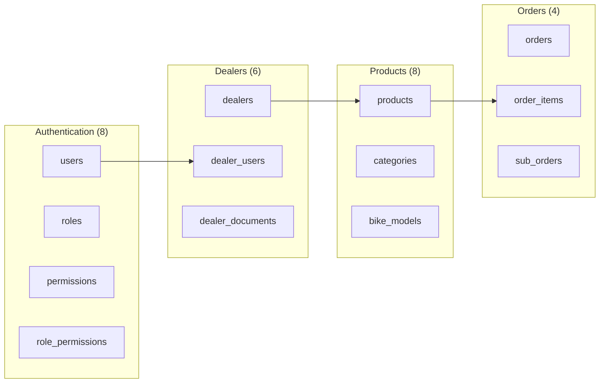
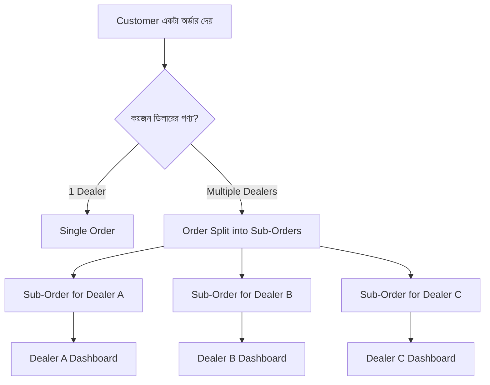

# 🗄️ RoyalConsortium Database Architecture

> **মাল্টি-ভেন্ডর বাইক মার্কেটপ্লেস ডেটাবেস ডিজাইন**

---

## 📊 Database Overview

| Metric | Value |
|--------|-------|
| **Total Tables** | 62 |
| **Total Modules** | 14 |
| **Database** | PostgreSQL (Supabase) |
| **Primary Relationships** | 85+ Foreign Keys |

---

## 🏗️ Module-wise Table Summary



---

## 📋 Module A: Authentication & Users (8 Tables)

### A1. `roles` - সিস্টেম রোল সংজ্ঞা

| Column | Type | Description |
|--------|------|-------------|
| `id` | UUID | Primary Key |
| `name` | VARCHAR(50) | Unique role identifier |
| `display_name` | VARCHAR(100) | English name |
| `display_name_bn` | VARCHAR(100) | বাংলা নাম |
| `level` | INTEGER | Hierarchy (1=highest) |
| `role_type` | VARCHAR(20) | system/dealer/customer |
| `is_system_role` | BOOLEAN | Cannot delete if true |

**Default Roles:**
```sql
-- System Roles (Platform Staff)
super_admin (level: 1)  - সর্বোচ্চ ক্ষমতা
admin (level: 2)        - সাধারণ অ্যাডমিন
support (level: 3)      - সাপোর্ট স্টাফ
accountant (level: 4)   - হিসাবরক্ষক
viewer (level: 5)       - শুধু দেখতে পারবে

-- Dealer Roles (Shop Staff)
dealer_owner (level: 10)   - ডিলার মালিক
dealer_manager (level: 11) - ডিলার ম্যানেজার ✅
dealer_staff (level: 12)   - ডিলার স্টাফ ✅

-- Customer Role
customer (level: 99)    - সাধারণ কাস্টমার
```

> **⚠️ Note:** `dealer_manager` এবং `dealer_staff` রোল দিয়ে ডিলার তার স্টাফদের ম্যানেজ করতে পারবে।

---

### A2. `users` - সব ইউজার

| Column | Type | Description |
|--------|------|-------------|
| `id` | UUID | Primary Key |
| `email` | VARCHAR(255) | Unique email |
| `phone` | VARCHAR(20) | Unique phone |
| `password_hash` | TEXT | Encrypted password |
| `first_name` | VARCHAR(100) | প্রথম নাম |
| `last_name` | VARCHAR(100) | শেষ নাম |
| `role_id` | UUID | FK → roles |
| `dealer_id` | UUID | FK → dealers (NULL for admin/customer) |
| `status` | VARCHAR(20) | active/inactive/suspended/pending |
| `email_verified` | BOOLEAN | Email verified? |
| `mfa_enabled` | BOOLEAN | 2FA enabled? |

**Key Relationships:**
- `users.role_id` → `roles.id` (Many-to-One)
- `users.dealer_id` → `dealers.id` (Many-to-One, nullable)

---

### A3. `permissions` - ১০০+ পারমিশন

পারমিশন মডিউল অনুযায়ী গ্রুপ করা:

| Module | Example Permissions |
|--------|---------------------|
| `users` | view_all, create_admin, edit, delete, suspend |
| `dealers` | view_all, approve, reject, suspend, override_limits |
| `dealer_team` | view, add, edit, remove, set_permissions |
| `products` | view_all, create, edit, approve, reject, feature |
| `orders` | view_all, confirm, process, ship, cancel |
| `payments` | view_all, process_refund, approve_refund |
| `finance` | view_commissions, process_payout |
| `subscriptions` | manage_plans, assign, cancel, extend |
| `reports` | platform_dashboard, dealer_dashboard, export |
| `emergency` | freeze_dealer, freeze_payments, backup |

---

### A4. `role_permissions` - Role-Permission Mapping

```sql
1 Role → Many Permissions
1 Permission → Many Roles
```

---

### A5-A8. Security Tables

| Table | Purpose |
|-------|---------|
| `user_sessions` | Active login sessions tracking |
| `audit_logs` | Immutable action logs (cannot delete) |
| `otp_verifications` | OTP for phone/email verification |
| `password_resets` | Password reset tokens |

---

## 📋 Module B: Dealer Management (6 Tables)

### B1. `dealers` - ডিলার/দোকান

| Section | Key Fields |
|---------|------------|
| **Basic Info** | business_name, slug, email, phone |
| **Legal** | trade_license_no, tin_number, bin_number |
| **Branding** | logo_url, banner_url, description |
| **Address** | address_line1, city, district, division |
| **Owner** | owner_user_id, owner_name, owner_nid |
| **Status** | status (pending/active/suspended/rejected/closed) |
| **Subscription** | current_plan_id, subscription_status, trial_ends_at |
| **Commission** | commission_rate (default 10%), commission_type |
| **Limits** | max_products, max_users, max_images_per_product |
| **Stats** | total_products, total_orders, total_revenue, average_rating |

**Key Relationships:**
```
1 Dealer → 1 Owner User (owner_user_id)
1 Dealer → 1 Active Plan (current_plan_id)
1 Dealer → Many Products
1 Dealer → Many Team Members (dealer_users)
```

---

### B2. `dealer_users` - ডিলার টিম

```sql
-- ডিলার তার স্টাফদের এখানে যোগ করবে
dealer_id → dealers.id
user_id → users.id
dealer_role: 'owner' | 'manager' | 'staff'

-- Granular Permissions (Staff-এর জন্য কাস্টমাইজ করা যায়)
can_manage_products: BOOLEAN
can_manage_orders: BOOLEAN
can_view_reports: BOOLEAN
can_manage_inventory: BOOLEAN
can_manage_coupons: BOOLEAN
can_manage_staff: BOOLEAN (manager only)
can_view_finance: BOOLEAN
can_reply_reviews: BOOLEAN
```

> **✅ Note:** `dealer_manager` প্রোডাক্ট, অর্ডার, ইনভেন্টরি সব ম্যানেজ করতে পারবে। `dealer_staff` শুধু নির্দিষ্ট কাজ করতে পারবে যা owner/manager সেট করবে।

---

### B3-B6. Support Tables

| Table | Purpose |
|-------|---------|
| `dealer_documents` | Trade license, NID, etc. uploads |
| `dealer_bank_accounts` | Bank/bKash for payout settlement |
| `dealer_settings` | Dealer-specific key-value settings |
| `dealer_notifications` | Notification preferences |

---

## 📋 Module C: Product Catalog (8 Tables)

### C1. `bike_models` - সুজুকি বাইক মডেল

```sql
-- Pre-loaded Suzuki models for Bangladesh
Gixxer SF (155cc), Gixxer SF 250 (249cc)
GSX-R150, GSX-S150, Hayabusa (1340cc)
Gixxer 150, Gixxer 250, Intruder 150
Access 125, Burgman Street, Avenis 125
V-Strom SX, Universal (for generic parts)
```

---

### C2. `categories` - Hierarchical Categories

```
Level 0 (Root):
├── Engine Oil
│   └── 4T Engine Oil, 2T Engine Oil, Gear Oil, Fork Oil
├── Bike Accessories
│   └── Mobile Holders, Mirrors, Seat Covers, Crash Guards
├── Spare Parts
│   └── Brake Pads, Chain & Sprocket, Air Filters, Clutch Parts
├── Riding Gear
│   └── Helmets, Jackets, Gloves, Knee Guards
├── Tyres & Wheels
├── Battery
├── Lights & Electricals
├── Body Parts
├── Tools & Maintenance
└── Performance Parts
```

---

### C3. `products` - মূল প্রোডাক্ট

| Section | Key Fields |
|---------|------------|
| **Ownership** | dealer_id (FK) |
| **Basic** | name, slug, sku, part_number |
| **Category** | category_id, sub_category_id, brand |
| **Description** | short_description, description, specifications (JSONB) |
| **Pricing** | base_price, sale_price, cost_price, discount_type |
| **Inventory** | stock_quantity, low_stock_threshold, stock_status |
| **Shipping** | weight, length, width, height, is_free_shipping |
| **Status** | status (draft/pending/active/rejected/blocked) |
| **Approval** | submitted_at, approved_at, approved_by, rejection_reason |
| **Features** | is_featured, is_new_arrival, is_best_seller, is_genuine |
| **Stats** | total_sold, total_views, average_rating, review_count |

**Relationships:**
```
1 Dealer → Many Products
1 Category → Many Products
1 Product → Many Bike Models (via product_bike_models)
1 Product → Many Images (via product_images)
1 Product → Many Variants (via product_variants)
```

---

### C4-C8. Supporting Tables

| Table | Purpose |
|-------|---------|
| `product_bike_models` | Product compatibility with bike models |
| `product_images` | Product image gallery |
| `product_variants` | Size, color variations |
| `product_attributes` | Attribute definitions (color, size, viscosity) |
| `inventory` | Stock movement tracking |

---

## 📋 Module D: Shopping (4 Tables)

### D1. `customer_addresses`
কাস্টমারের সেভ করা ডেলিভারি এড্রেস

### D2. `carts`
শপিং কার্ট (logged-in or guest via cookie)

### D3. `cart_items`
কার্টের আইটেম

### D4. `wishlists`
পছন্দের প্রোডাক্ট সেভ করা

---

## 📋 Module E: Orders (Multi-Vendor) ⚠️ Critical

### 🔥 Multi-Vendor Order Logic



---

### E1. `orders` - Parent Order

| Column | Type | Description |
|--------|------|-------------|
| `id` | UUID | Primary Key |
| `order_number` | VARCHAR(50) | Unique order ID (e.g., RC-2026-0001) |
| `user_id` | UUID | FK → users (customer) |
| `status` | VARCHAR(20) | pending/confirmed/processing/shipped/delivered/cancelled |
| **Shipping** | | |
| `shipping_address_id` | UUID | FK → customer_addresses |
| `shipping_name` | VARCHAR(255) | Recipient name (snapshot) |
| `shipping_phone` | VARCHAR(20) | Recipient phone (snapshot) |
| `shipping_address` | TEXT | Full address (snapshot) |
| **Pricing** | | |
| `subtotal` | DECIMAL(12,2) | Before discounts |
| `discount_amount` | DECIMAL(10,2) | Coupon/promo discount |
| `shipping_cost` | DECIMAL(10,2) | Delivery charge |
| `tax_amount` | DECIMAL(10,2) | Tax |
| `grand_total` | DECIMAL(12,2) | Final amount |
| **Payment** | | |
| `payment_status` | VARCHAR(20) | pending/paid/partial/failed/refunded |
| `payment_method` | VARCHAR(50) | bkash/cod/bank |

---

### E2. `order_items` - Order Line Items

| Column | Type | Description |
|--------|------|-------------|
| `order_id` | UUID | FK → orders |
| `product_id` | UUID | FK → products |
| `dealer_id` | UUID | FK → dealers |
| `quantity` | INTEGER | পরিমাণ |
| `unit_price` | DECIMAL(10,2) | Per unit price |
| `total_price` | DECIMAL(12,2) | quantity × unit_price |
| `sub_order_id` | UUID | FK → sub_orders (for multi-vendor) |

---

### E3. `sub_orders` - Dealer-wise Split (Optional but Recommended)

```sql
-- যখন কাস্টমার multiple dealer থেকে কেনে
CREATE TABLE sub_orders (
    id UUID PRIMARY KEY,
    order_id UUID REFERENCES orders(id),      -- Parent order
    dealer_id UUID REFERENCES dealers(id),    -- কোন ডিলারের জন্য
    
    -- Dealer-specific status
    status VARCHAR(20),  -- Each dealer manages their portion
    
    -- Pricing for this dealer's portion
    subtotal DECIMAL(12,2),
    commission_amount DECIMAL(10,2),  -- Platform কতটুকু নিবে
    dealer_amount DECIMAL(10,2),      -- Dealer পাবে
    
    -- Shipping
    tracking_number VARCHAR(100),
    shipped_at TIMESTAMPTZ,
    delivered_at TIMESTAMPTZ
);
```

**Relationship Flow:**
```
1 Customer → Many Orders
1 Order → Many Order_Items
1 Order → Many Sub_Orders (1 per dealer)
1 Sub_Order → Many Order_Items (same dealer)
1 Product → Order_Item → Dealer (এভাবে ডিলার জানবে)
```

---

### E4. `order_status_history`
Order status changes log

### E5. `order_notes`
Internal notes for orders

---

## 📋 Module F: Payments & Finance (6 Tables)

### F1. `payments`

| Column | Type | Description |
|--------|------|-------------|
| `order_id` | UUID | FK → orders |
| `amount` | DECIMAL(12,2) | Payment amount |
| `method` | VARCHAR(50) | bkash/nagad/cod/bank |
| `status` | VARCHAR(20) | pending/completed/failed/refunded |
| `gateway_transaction_id` | VARCHAR(100) | bKash transaction ID |
| `gateway_response` | JSONB | Full gateway response |

### F2. `refunds`
Refund tracking

### F3. `commissions`
Platform commission per order/sub_order

### F4. `dealer_payouts`
Dealer payout batches

### F5. `payout_items`
Individual payout line items

### F6. `transactions`
All financial transactions log

---

## 📋 Module G: Subscriptions (4 Tables)

### G1. `plans` - সাবস্ক্রিপশন প্ল্যান

| Plan | Price | Products | Users | Commission |
|------|-------|----------|-------|------------|
| Starter | ৳999/mo | 50 | 2 | 12% |
| Professional | ৳2499/mo | 200 | 5 | 8% |
| Enterprise | ৳4999/mo | Unlimited | 15 | 5% |

### G2. `plan_features`
Features included in each plan

### G3. `subscriptions`
```sql
1 Dealer → 1 Active Subscription
1 Subscription → 1 Plan
```

### G4. `subscription_invoices`
Monthly billing records

---

## 📋 Remaining Modules Summary

| Module | Tables | Purpose |
|--------|--------|---------|
| **H. Shipping** | 3 | zones, methods, rates |
| **I. Marketing** | 4 | coupons, banners, promotions |
| **J. Reviews** | 2 | customer reviews & replies |
| **K. Support** | 3 | tickets, messages |
| **L. CMS** | 4 | pages, FAQs, templates |
| **M. Notifications** | 3 | in-app, email, push |
| **N. System** | 3 | settings, feature_flags, activity_logs |

---

## 🔒 Row Level Security (RLS) Policies

### Critical RLS Rules:

```sql
-- Dealers can only see their own products
CREATE POLICY "Dealers see own products" ON products
    FOR SELECT USING (dealer_id = auth.jwt() ->> 'dealer_id');

-- Dealers can only see their sub_orders
CREATE POLICY "Dealers see own sub_orders" ON sub_orders
    FOR SELECT USING (dealer_id = auth.jwt() ->> 'dealer_id');

-- Customers can only see their own orders
CREATE POLICY "Customers see own orders" ON orders
    FOR SELECT USING (user_id = auth.uid());

-- Audit logs cannot be deleted (by anyone)
CREATE POLICY "No delete on audit_logs" ON audit_logs
    FOR DELETE USING (false);
```

---

## 📈 Important Indexes

```sql
-- Performance critical indexes
CREATE INDEX idx_products_dealer ON products(dealer_id);
CREATE INDEX idx_products_category ON products(category_id);
CREATE INDEX idx_products_status ON products(status);
CREATE INDEX idx_orders_user ON orders(user_id);
CREATE INDEX idx_order_items_dealer ON order_items(dealer_id);
CREATE INDEX idx_sub_orders_dealer ON sub_orders(dealer_id);

-- Full-text search
CREATE INDEX idx_products_search ON products 
    USING gin(to_tsvector('english', name || ' ' || description));
```

---

## 🔄 Database Migrations Order

```
Migration 1: Core Auth Tables
  └── roles, permissions, role_permissions, users

Migration 2: Dealer Tables  
  └── plans, dealers, subscriptions, dealer_users, dealer_documents

Migration 3: Product Tables
  └── bike_models, categories, products, product_variants

Migration 4: Order Tables
  └── orders, order_items, sub_orders, payments

Migration 5: Supporting Tables
  └── reviews, coupons, notifications, audit_logs

Migration 6: RLS Policies & Functions
  └── All security policies and triggers
```

---

## ✅ Key Takeaways

1. **Multi-Vendor Orders**: `sub_orders` টেবিল ব্যবহার করে ডিলার-wise অর্ডার split হবে
2. **Role Hierarchy**: Level-based permission system (lower = more power)
3. **Dealer Team**: `dealer_users` দিয়ে manager/staff ম্যানেজ করা যাবে
4. **Commission**: Plan অনুযায়ী different commission rates
5. **Audit Trail**: সব action log হবে, delete করা যাবে না
